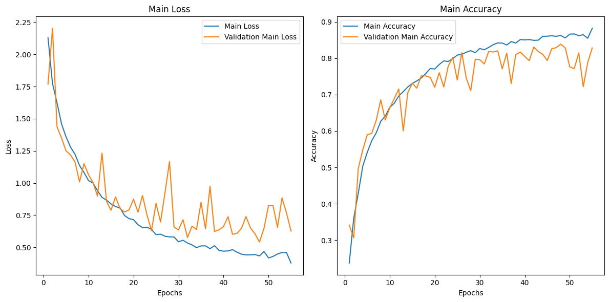
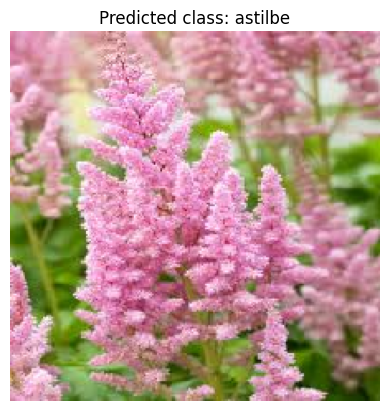

# GoogLeNet Flower Prediction

This repository contains an implementation of the GoogLeNet architecture for flower classification using TensorFlow and Keras. The goal of this project was to experiment with the GoogLeNet architecture, understand its advantages, and apply it to the task of flower recognition.

## Table of Contents

- [Description](#description)
- [Dataset](#dataset)
- [Requirements](#requirements)
- [Installation](#installation)
- [Usage](#usage)
- [Results](#results)
- [Contributing](#contributing)
- [License](#license)

## Description

GoogLeNet, also known as Inception V1, is a convolutional neural network architecture designed for efficient and accurate image classification. It introduces the Inception module, which allows for parallel computing of different filter sizes within the same layer, resulting in improved performance and reduced computational cost.

This project aims to explore the GoogLeNet architecture and its advantages by applying it to the task of flower classification. The implementation is written in Python using TensorFlow and Keras.

## Dataset

The dataset used for this project is the Flowers dataset, which consists of 11,332 images across 16 different flower categories. The dataset is available on Kaggle and can be downloaded using the provided script.

## Requirements

- Python 3.x
- TensorFlow
- Keras
- NumPy
- Pandas
- Matplotlib
- Scikit-learn

## Installation

1. Clone the repository:

git clone https://github.com/your-username/googlenet-flower-prediction.git

2. Navigate to the project directory:

cd googlenet-flower-prediction

3. Install the required dependencies:

pip install -r requirements.txt

## Usage

1. Run the `googlenet_implementation.py` script:
python googlenet_implementation.py

This script will download the Flowers dataset, preprocess the data, train the GoogLeNet model, and evaluate its performance on the test set.

2. The script also includes code for visualizing the training history and making predictions on custom images.

## Results

The trained GoogLeNet model achieved an accuracy of 87% on the test set. The training and validation loss curves, as well as the accuracy plots are shown below

### Live Prediction
The script also includes code for making predictions on custom images.

## Contributing

Contributions to this project are welcome. If you find any issues or have suggestions for improvements, please open an issue or submit a pull request.

## License

This project is licensed under the [MIT License](LICENSE).
